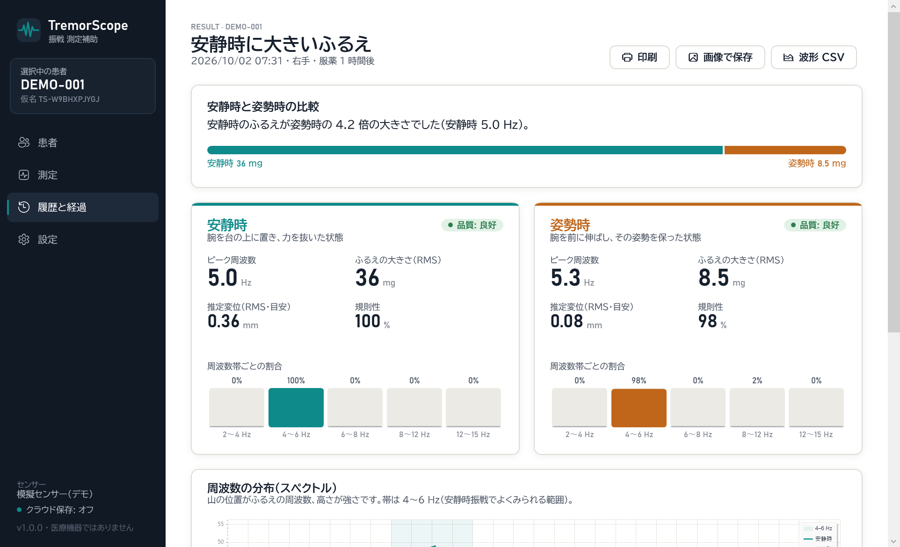
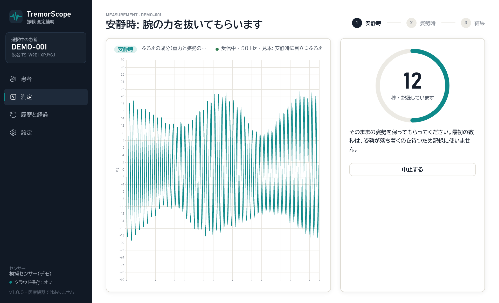
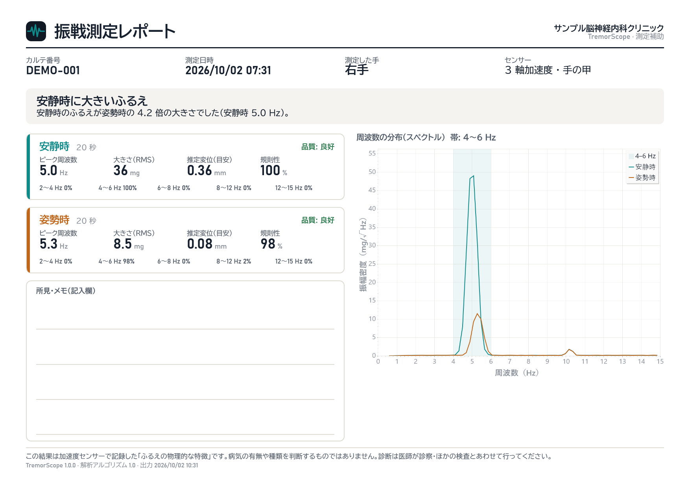
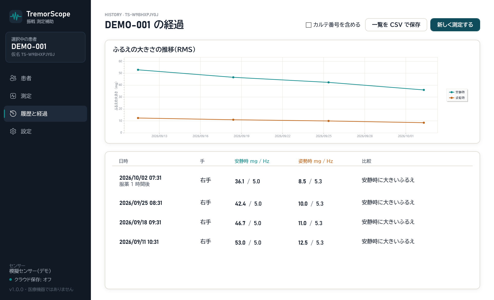
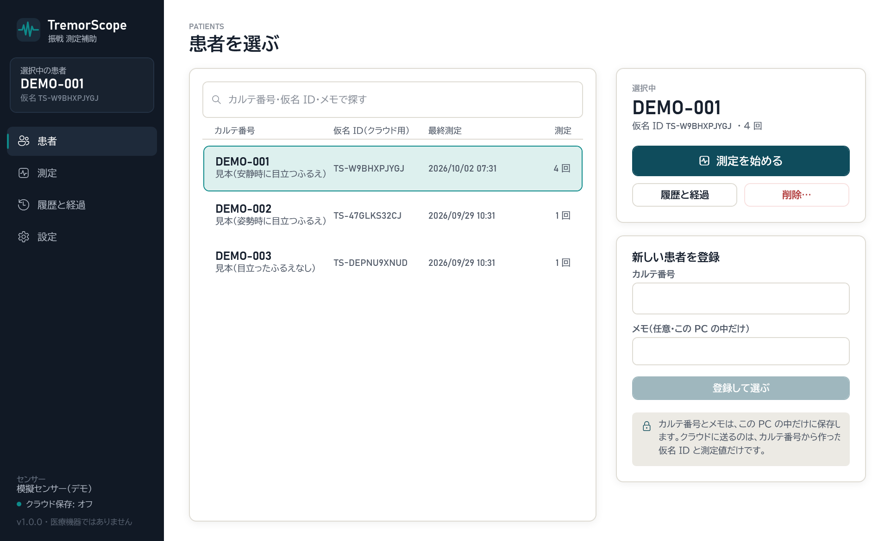
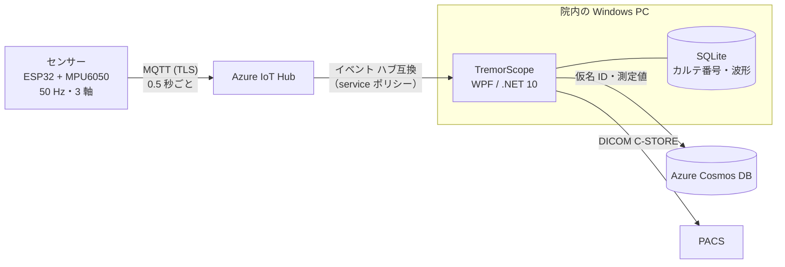
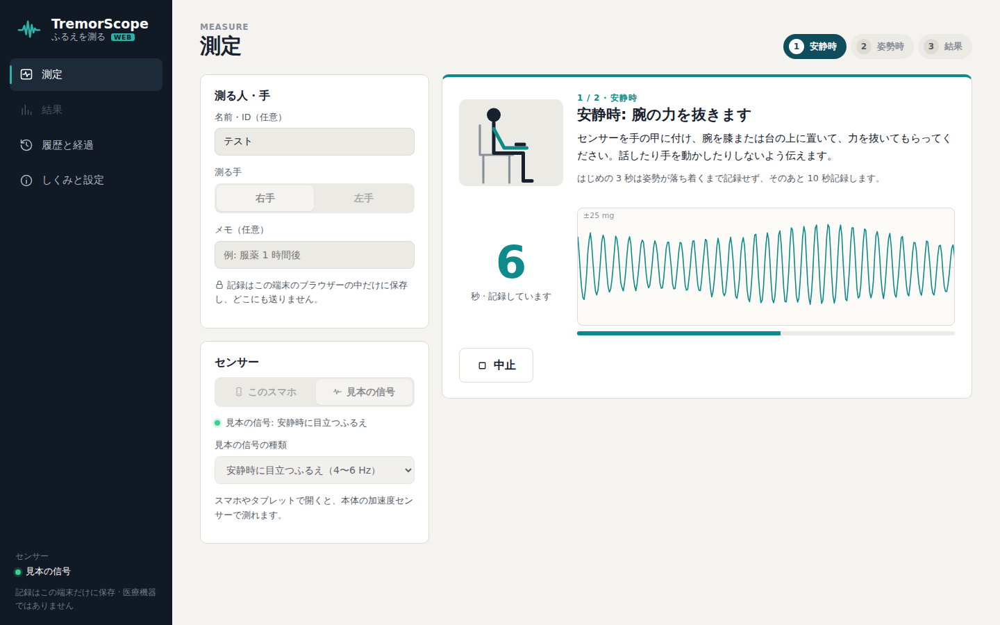
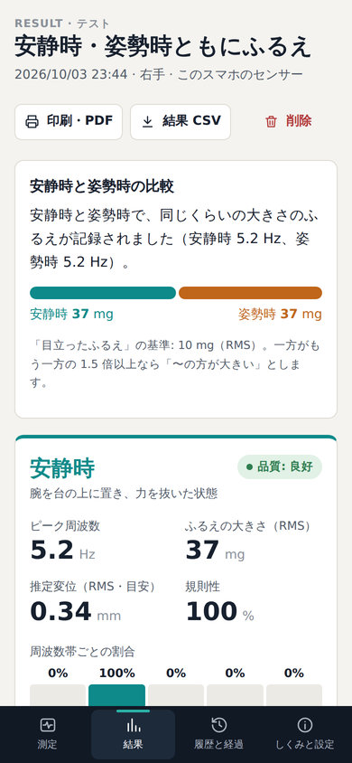

# TremorScope — 振戦（ふるえ）測定補助ソフト

手の甲に付けた 3 軸加速度センサーで **安静時** と **姿勢時** のふるえを 20 秒ずつ記録し、
周波数・大きさ・規則性を数値にして、2 つの条件を比べるソフトです。医療機関での **測定の補助** を想定しています。

> **診断はしません。** 結果は「ふるえの物理的な特徴」であり、病気の有無や種類を判断するものではありません。
> 本ソフトは医療機器として承認・認証を受けていません。

**▶ ブラウザーで開く: https://haru-ki417.github.io/TremorScope/** 　スマホ・タブレットなら、本体の加速度センサーでそのまま測れます（インストール不要。記録はその端末の中だけに保存し、どこにも送りません）。



## なぜ作ったか

パーキンソン病では **安静時に 4〜6 Hz** のふるえが出やすく、本態性振戦では **腕を伸ばしたとき（姿勢時）** に目立つことが多い、という特徴があります。
診察ではこの違いを目で見て判断しますが、「どのくらいの速さ・大きさか」「前回と比べてどうか」を数値で残すのは難しいのが現状です。
TremorScope は、手順を決めた 2 回の測定と、診察の記録に貼れるレポートで、この部分を補います。

## できること

| | |
| --- | --- |
| **2 段階の測定** | 安静時 → 姿勢時を画面の案内どおりに測る。はじめの 3 秒は姿勢が落ち着くまで捨てる。測った直後に品質を確認し、取り直せる |
| **解析** | ピーク周波数・ふるえの大きさ（RMS, mg）・推定変位（mm）・規則性・周波数帯ごとの割合 |
| **品質の確認** | センサーが動いていない・通信の欠け・時間不足・振り切れ・腕の大きな動き を検出して知らせる |
| **比較** | 安静時と姿勢時のどちらが大きいかを、事実だけの文章で示す（基準は設定で変えられる） |
| **経過** | 患者ごとの推移のグラフと一覧、CSV 出力 |
| **レポート** | A4 横の印刷・PNG 保存・**DICOM（Secondary Capture）で PACS へ送信** |
| **クラウド保存** | Azure Cosmos DB へ（仮名 ID のみ。送れなかった分は自動で再送） |
| **センサー** | 自作センサー（ESP32 + MPU6050）→ Azure IoT Hub。センサーがなくても模擬センサーで操作できる |

<table>
<tr>
<td></td>
<td></td>
</tr>
<tr><td align="center">測定中（残り秒数・ふるえの波形）</td><td align="center">レポート（印刷・PACS 用）</td></tr>
<tr>
<td></td>
<td></td>
</tr>
<tr><td align="center">経過（推移のグラフと一覧）</td><td align="center">患者（カルテ番号と仮名 ID）</td></tr>
</table>

画面の画像は、見本のデータ（DEMO-xxx・模擬センサー）で `TremorScope.exe --snapshots` を実行して作ったものです。

## 個人情報の扱い

- **カルテ番号はこの PC の外に出しません。** クラウドに送るのは、カルテ番号から施設ごとの鍵で作った **仮名 ID**（HMAC-SHA256）と測定値だけです。
- 接続文字列・キー・施設の鍵は Windows の DPAPI で暗号化して保存します。
- 患者を削除すると、この PC とクラウドの両方から消えます。

詳しくは [SECURITY.md](SECURITY.md) を見てください。

## しくみ



| プロジェクト | 中身 |
| --- | --- |
| `src/TremorScope.Core` | 信号処理・解析・品質確認・比較・仮名化・CSV / DICOM（画面にも Azure にも依存しない） |
| `src/TremorScope.Infrastructure` | IoT Hub 受信・SQLite（EF Core）・Cosmos DB・PACS・暗号化した設定 |
| `src/TremorScope.App` | WPF の画面（MVVM）・レポートの描画 |
| `src/TremorScope.Web` | ブラウザー版（Blazor WebAssembly）。スマホの加速度センサーで測り、記録はその端末だけに保存。GitHub Pages で公開 |
| `tests/TremorScope.Tests` | 58 件のテスト（正解の分かる信号で解析を検証・保存と個人情報の確認 など） |
| `firmware/TremorSensor` | ESP32 のファームウェア（参考実装） |

### 解析の手順

1. 3 軸それぞれから重力と姿勢のゆっくりした変化を除く（1 Hz の高域通過、位相のずれない前後 2 回のフィルター）
2. Welch 法でスペクトルを求め（約 5 秒・ハン窓・50% 重ね）、**3 軸を足し合わせる**（センサーの向きによらない）
3. 2〜15 Hz で最も強い周波数を、放物線の補間で求める
4. 帯域の強さから RMS（mg）、`a / (2πf)²` で推定変位（mm）、ピーク ±1 Hz への集中度から規則性を求める

テストでは、周波数・振幅が分かっている正弦波で、ピーク周波数（±0.08 Hz）・RMS・変位・パーセバルの定理・向きによらないことを確かめています。

## ブラウザー版（スマホ・タブレット・パソコン）

https://haru-ki417.github.io/TremorScope/ を開くだけで使えます。専用のセンサーの代わりに **スマホ・タブレット本体の加速度センサー** で測ります。解析は Windows 版と同じ計算の部品（`TremorScope.Core`）を WebAssembly にして、ブラウザーの中で動かしています。

<table>
<tr>
<td width="74%"></td>
<td></td>
</tr>
<tr><td align="center">測定（パソコンでは見本の信号で試せる）</td><td align="center">結果（スマホ）</td></tr>
</table>

- **測り方**: スマホを手の甲に乗せ、安静時 → 姿勢時を画面の案内どおりに測る。「開始」から数秒の準備時間があり、始まり・終わりを振動で知らせる（対応端末）。測定中は画面が消えないようにする
- **50 Hz にそろえる**: ブラウザーのセンサーの値（多くは 60 Hz 前後で、間隔が少し揺れる）を時刻で直線補間し、解析の前提の等間隔（50 Hz）にする。0.2 秒より長い途切れ（画面が消えた・別のアプリに切りかえた）は「届かなかった点」として数え、Windows 版と同じ品質の確認で知らせる
- **記録の扱い**: 名前・メモ・波形・結果は、その端末のブラウザーの中（localStorage）だけに保存し、どこにも送らない。CSV（結果・波形）での書き出しと、印刷（PDF 保存）でのレポートができる
- **センサーがない端末**: パソコンでは Windows 版と同じ見本の信号（安静時に目立つふるえ・姿勢時に目立つふるえ・なし）で操作を試せる
- iPhone・iPad では、はじめに「センサーを使う」を押して、モーションセンサーの使用を許可する
- 専用センサー（ESP32）・クラウド保存・PACS 連携は、病院での運用を想定した Windows 版の機能

## 使ってみる

- **ブラウザー版**: https://haru-ki417.github.io/TremorScope/

- **配布版**: [Releases](../../releases) の zip を展開して `TremorScope.exe` を起動（.NET のインストール不要）。
- **センサーなしで試す**: 初期設定は模擬センサーです。患者「DEMO-001」を登録して「測定を始める」を押してください。
- **センサー・Azure・PACS の準備**: [docs/setup.md](docs/setup.md)

## 開発

```bash
# .NET 10 SDK
dotnet build TremorScope.slnx
dotnet test --solution TremorScope.slnx
dotnet run --project src/TremorScope.App
dotnet run --project src/TremorScope.Web      # ブラウザー版（開発用のサーバー）。公開版の作成には `dotnet workload install wasm-tools` が必要

# 見本のデータで全画面を画像に保存（docs/screenshots の作り方）
TremorScope.exe --snapshots docs/screenshots
```

- 警告はすべてエラー扱い（`TreatWarningsAsErrors`・.NET のコード解析 `latest-recommended`）
- GitHub Actions: プッシュごとに Windows でビルド・テスト・マイグレーションの確認、Linux でブラウザー版のビルド。main へのプッシュでブラウザー版を GitHub Pages に公開。リリースを公開すると配布用 zip を自動で添付

## 制限と今後

- 解析の数値は、加速度計を使った振戦研究で一般的な手法に基づく **目安** です。臨床的な妥当性の検証（既存の評価尺度や他の機器との比較）はしていません。
- 診断や治療の判断に使うことを目的として提供する場合は、医薬品医療機器等法（プログラム医療機器）の手続きが必要になる可能性があります。
- 今後: 両手の同時測定、動作時（指鼻試験）の条件、測定手順の動画ガイド。

## ライセンス

[MIT](LICENSE)。使用しているソフトウェアは [THIRD_PARTY_NOTICES.md](THIRD_PARTY_NOTICES.md) を見てください。
